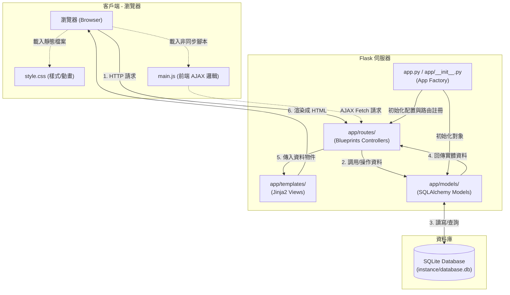

# 系統架構文件 (ARCHITECTURE.md) - 逢甲美食評論網

本文件詳細規劃「逢甲美食評論網」的技術架構、資料夾結構、元件關係以及關鍵設計決策，作為後續資料庫設計與程式碼實作的指引。

---

## 1. 技術架構說明

本系統採用標準的 **MVC (Model-View-Controller)** 架構模式，透過 Flask 框架將資料儲存、業務邏輯與畫面呈現進行解耦。

### 選用技術與原因
*   **後端框架：Python + Flask**
    *   *選用原因*：Flask 屬於微型（Micro）框架，結構簡單且靈活性高，沒有 Django 等框架的過度封裝，非常適合快速開發與小型團隊進行敏捷開發。
*   **模板引擎：Jinja2**
    *   *選用原因*：作為 Flask 內建的模板引擎，Jinja2 允許我們在 HTML 中使用類似 Python 的語法進行動態資料渲染。這省去了額外建立前端編譯鏈（如 React/Vue）的麻煩，且對搜尋引擎友善（SEO 佳）。
*   **資料庫：SQLite (搭配 Flask-SQLAlchemy)**
    *   *選用原因*：SQLite 是伺服器免設定的輕量關聯式資料庫，所有資料都儲存在單一檔案中，非常適合本專案的本機開發環境與簡單部署。搭配 ORM 框架 Flask-SQLAlchemy 可提升程式碼可讀性並防止 SQL 注入。
*   **前端樣式：Vanilla CSS (響應式設計)**
    *   *選用原因*：本專案著重於視覺美感（Wow 級體驗）。使用 Vanilla CSS 能精準掌控 CSS 變數（Variables）、HSL 調色系統、毛玻璃效果（Glassmorphism）與精緻微動畫，提供流暢的使用者體驗。

### Flask MVC 模式對照
```
                  ┌──────────────────────┐
                  │      瀏覽器 (Client)  │
                  └──────────┬───────────┘
               HTTP 請求 (Request) │ ▲ HTML 渲染 (Response)
                             ▼ │
                  ┌──────────────────────┐
                  │ Controller (Routes)  │
                  └──────┬────────────┬──┘
    調用資料 (ORM) 傳遞   │            │ 渲染模板與綁定資料
    或更新狀態 (State)    ▼            ▼
               ┌────────────┐     ┌────────────┐
               │Model(Class)│     │ View(Jinja)│
               └─────┬──────┘     └────────────┘
         讀寫 │
              ▼
       ┌─────────────┐
       │ SQLite (DB) │
       └─────────────┘
```
*   **Model (模型)**：定義於 `app/models/`，代表資料實體與商業邏輯。負責定義 SQLite 資料表結構與資料關聯，並提供資料格式校驗（如信箱正則過濾）。
*   **View (視圖)**：定義於 `app/templates/` 與 `app/static/`，代表呈現給使用者的介面。Jinja2 HTML 負責骨架，Vanilla CSS 負責視覺，Vanilla JS 負責非同步互動（如按讚評論）。
*   **Controller (控制器/路由)**：定義於 `app/routes/`，接收 HTTP 請求，處理業務邏輯（判斷登入狀態、篩選條件），向 Model 索取資料後，傳遞給 View 渲染並回傳。

---

## 2. 專案資料夾結構

本專案採用 **App Factory 模式** 進行組織，將路由按模組拆分為 Blueprint，確保專案結構清晰、便於分工。

```text
fcufoodgrade/
├── app/                      # 應用程式核心資料夾
│   ├── __init__.py           # Flask App Factory (初始化 DB、註冊 Blueprints)
│   ├── models/               # 資料庫模型 (Model 層)
│   │   ├── __init__.py       
│   │   ├── user.py           # 使用者 (User) 模型與信箱格式檢查
│   │   ├── restaurant.py     # 餐廳 (Restaurant) 模型與區域/標籤定義
│   │   ├── review.py         # 評論 (Review) 及回覆 (Reply) 模型
│   │   └── favorite.py       # 收藏與口袋名單模型
│   ├── routes/               # 路由控制器 (Controller 層)
│   │   ├── __init__.py       
│   │   ├── auth.py           # 註冊、登入、登出路由 (Blueprint: auth)
│   │   ├── restaurant.py     # 餐廳瀏覽、搜尋、多維度篩選路由 (Blueprint: restaurant)
│   │   ├── review.py         # 評論發表、留言、按讚互動路由 (Blueprint: review)
│   │   └── favorite.py       # 收藏餐廳、自訂口袋名單路由 (Blueprint: favorite)
│   ├── static/               # 靜態資源 (前端視圖輔助)
│   │   ├── css/
│   │   │   └── style.css     # 全域樣式 (定義 HSL 色彩、Glassmorphism、微動畫與 RWD)
│   │   ├── js/
│   │   │   └── main.js       # 全域前端互動 (非同步 Fetch 按讚、彈窗控制)
│   │   └── images/           # 網站圖標、預設餐廳照片
│   └── templates/            # Jinja2 模板 (View 層)
│       ├── base.html         # 基礎骨架模板 (含導覽列、頁尾、全域樣式)
│       ├── auth/
│       │   ├── login.html    # 登入頁面
│       │   └── register.html # 註冊頁面 (含學號驗證提示)
│       ├── restaurant/
│       │   ├── list.html     # 餐廳搜尋與多選標籤篩選列表頁
│       │   └── detail.html   # 餐廳詳細資訊與評論互動頁
│       └── favorite/
│           └── list.html     # 個人口袋名單與自訂收藏清單頁
├── docs/                     # 專案設計文件
│   ├── PRD.md                # 產品需求文件
│   └── ARCHITECTURE.md       # 本系統架構文件
├── instance/                 # Flask 實例專用區 (本地配置與 SQLite 存放處，不納入 Git)
│   └── database.db           # SQLite 實際資料庫檔案
├── .gitignore                # Git 忽略設定 (排除 __pycache__、venv 與 instance/)
├── requirements.txt          # Python 套件依賴清單
└── app.py                    # 專案入口啟動檔 (載入 App Factory 並執行)
```

---

## 3. 元件關係圖

以下使用 Mermaid 圖表，呈現當使用者在瀏覽器操作時，系統內部的資料與控制流向：



---

## 4. 關鍵設計決策

### 決策一：路由解耦 - Blueprint 模組化設計
*   **決策說明**：捨棄將所有路由擠在單一 `app.py` 的做法，採用 Flask Blueprints 機制依功能分開（如 `auth`、`restaurant`、`review`、`favorite`）。
*   **決策原因**：
    1.  **分工明確**：允許多位工程師同時開發不同的功能模組，減少 Git 衝突。
    2.  **維護度高**：當「收藏功能」出問題時，可以直接鎖定 `routes/favorite.py` 進行除錯，不用在千行代碼中大海撈針。

### 決策二：資料讀寫 - 採用 Flask-SQLAlchemy (ORM)
*   **決策說明**：不使用底層 `sqlite3` 撰寫 Raw SQL 指令，改採 SQLAlchemy 作為對接 SQLite 的媒介。
*   **決策原因**：
    1.  **安全性**：ORM 自動處理參數綁定，防範 SQL 注入攻擊（SQL Injection）。
    2.  **物件化操作**：使用 Python 類別屬性（如 `user.username`）操作資料，直觀且降低人為拼寫錯誤。
    3.  **可移植性**：若未來資料庫需要從 SQLite 遷移至 MySQL 或 PostgreSQL，僅需更改設定字串，不需重寫 SQL 語法。

### 決策三：渲染模式 - 後端 Jinja2 一體化渲染
*   **決策說明**：不採用目前流行的 API + SPA 前後端分離（如 React/Vue），而是直接用 Flask 結合 Jinja2 模板直接輸出 HTML。
*   **決策原因**：
    1.  **降低技術複雜度**：無需處理跨來源資源共用 (CORS)、前端路由、及複雜的前端狀態管理 (Redux/Pinia)。
    2.  **開發效率高**：後端直接查詢並渲染，適合短週期開發。
    3.  **會話安全**：可以直接依賴 Flask 安全的 Session 機制，降低 Token 竊取風險。

### 決策四：安全控管 - 強制正則域名與密碼單向雜湊
*   **決策說明**：在註冊階段以 Regex 強制過濾信箱必須為 `@fcu.edu.tw` 與 `@mail.fcu.edu.tw`。使用者密碼一律經 `werkzeug.security` 的 `generate_password_hash` 處理後再入庫。
*   **決策原因**：
    1.  符合 PRD 中「排除觀光客及無效業配的雜音」的核心要求。
    2.  確保資料庫即使洩漏，使用者的明文密碼也不會曝光，符合非功能性安全需求。
