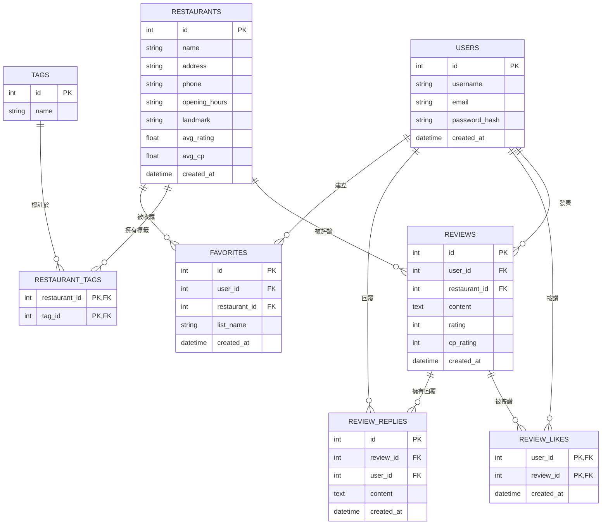

# 資料庫設計文件 (DB_DESIGN.md) - 逢甲美食評論網

本文件定義「逢甲美食評論網」專案的 SQLite 資料庫設計。系統採用 Flask-SQLAlchemy 作為 ORM 映射引擎，實體關係如下所述。

---

## 1. ER 圖 (實體關係圖)

以下使用 Mermaid erDiagram 語法繪製實體關係。圖中定義了使用者、餐廳、評論、標籤、按讚、回覆留言以及口袋名單的關聯：



---

## 2. 資料表詳細說明

### 2.1 users (使用者帳號表)
*   **用途**：儲存註冊學生的帳號資訊，僅限逢甲大學信箱註冊。
*   **欄位說明**：
    | 欄位名稱 | 資料型別 | 主/外鍵 | 允許空值 | 說明 |
    | :--- | :--- | :--- | :--- | :--- |
    | `id` | INTEGER | PK | NO | 自動增量 ID |
    | `username` | VARCHAR(50) | - | NO | 使用者名稱（唯一） |
    | `email` | VARCHAR(120) | - | NO | 註冊逢甲信箱（唯一，須符合正則） |
    | `password_hash` | VARCHAR(128)| - | NO | 加密後的密碼 (Hash) |
    | `created_at` | DATETIME | - | NO | 帳號建立時間 (預設目前時間) |

### 2.2 restaurants (餐廳資料表)
*   **用途**：儲存逢甲夜市與校區周邊餐廳的基本資料，並快取平均評分。
*   **欄位說明**：
    | 欄位名稱 | 資料型別 | 主/外鍵 | 允許空值 | 說明 |
    | :--- | :--- | :--- | :--- | :--- |
    | `id` | INTEGER | PK | NO | 自動增量 ID |
    | `name` | VARCHAR(100) | - | NO | 餐廳名稱（建立索引） |
    | `address` | VARCHAR(200) | - | NO | 餐廳地址 |
    | `phone` | VARCHAR(20) | - | YES | 聯絡電話 |
    | `opening_hours`| VARCHAR(100) | - | YES | 營業時間說明 |
    | `landmark` | VARCHAR(50) | - | NO | 鄰近校園地標（如：正門、東門、西門、便當街；建立索引）|
    | `avg_rating` | FLOAT | - | NO | 平均美味星等 (預設 0.0) |
    | `avg_cp` | FLOAT | - | NO | 平均 CP 值星等 (預設 0.0) |
    | `created_at` | DATETIME | - | NO | 建立時間 (預設目前時間) |

### 2.3 tags (餐廳特徵標籤表)
*   **用途**：定義各種貼合學生需求的餐廳特徵標籤（如：平價、大份量、有插座、適合久坐、適合系聚）。
*   **欄位說明**：
    | 欄位名稱 | 資料型別 | 主/外鍵 | 允許空值 | 說明 |
    | :--- | :--- | :--- | :--- | :--- |
    | `id` | INTEGER | PK | NO | 自動增量 ID |
    | `name` | VARCHAR(50) | - | NO | 標籤名稱（唯一，如：平價） |

### 2.4 restaurant_tags (餐廳與標籤多對多關聯表)
*   **用途**：連結餐廳與標籤的對照表。
*   **欄位說明**：
    | 欄位名稱 | 資料型別 | 主/外鍵 | 允許空值 | 說明 |
    | :--- | :--- | :--- | :--- | :--- |
    | `restaurant_id`| INTEGER | PK, FK | NO | 餐廳 ID (對照 restaurants.id，連動刪除) |
    | `tag_id` | INTEGER | PK, FK | NO | 標籤 ID (對照 tags.id，連動刪除) |

### 2.5 reviews (美食食記評論表)
*   **用途**：儲存學生對餐廳發表的評論與雙重評分。
*   **欄位說明**：
    | 欄位名稱 | 資料型別 | 主/外鍵 | 允許空值 | 說明 |
    | :--- | :--- | :--- | :--- | :--- |
    | `id` | INTEGER | PK | NO | 自動增量 ID |
    | `user_id` | INTEGER | FK | NO | 發表人 ID (對照 users.id) |
    | `restaurant_id`| INTEGER | FK | NO | 餐廳 ID (對照 restaurants.id) |
    | `content` | TEXT | - | NO | 食記與評論內容 |
    | `rating` | INTEGER | - | NO | 美味度評分 (1 ~ 5) |
    | `cp_rating` | INTEGER | - | NO | CP 值評分 (1 ~ 5) |
    | `created_at` | DATETIME | - | NO | 發表時間 (預設目前時間) |

### 2.6 review_likes (評論有用按讚關係表)
*   **用途**：記錄使用者對評論點擊「有幫助」的按讚關係，以防重複點讚。
*   **欄位說明**：
    | 欄位名稱 | 資料型別 | 主/外鍵 | 允許空值 | 說明 |
    | :--- | :--- | :--- | :--- | :--- |
    | `user_id` | INTEGER | PK, FK | NO | 按讚使用者 ID (對照 users.id) |
    | `review_id` | INTEGER | PK, FK | NO | 被讚評論 ID (對照 reviews.id) |
    | `created_at` | DATETIME | - | NO | 按讚時間 |

### 2.7 review_replies (評論二級回覆表)
*   **用途**：支持學生在美食評論下方進行二級留言互動。
*   **欄位說明**：
    | 欄位名稱 | 資料型別 | 主/外鍵 | 允許空值 | 說明 |
    | :--- | :--- | :--- | :--- | :--- |
    | `id` | INTEGER | PK | NO | 自動增量 ID |
    | `review_id` | INTEGER | FK | NO | 被回覆之主評論 ID (對照 reviews.id) |
    | `user_id` | INTEGER | FK | NO | 回覆人 ID (對照 users.id) |
    | `content` | TEXT | - | NO | 回覆內容 |
    | `created_at` | DATETIME | - | NO | 回覆時間 (預設目前時間) |

### 2.8 favorites (個人口袋名單收藏表)
*   **用途**：管理學生收藏的口袋名單，支持將同餐廳分类收藏（如「宵夜首選」、「大一聚餐」）。
*   **欄位說明**：
    | 欄位名稱 | 資料型別 | 主/外鍵 | 允許空值 | 說明 |
    | :--- | :--- | :--- | :--- | :--- |
    | `id` | INTEGER | PK | NO | 自動增量 ID |
    | `user_id` | INTEGER | FK | NO | 收藏人 ID (對照 users.id) |
    | `restaurant_id`| INTEGER | FK | NO | 餐廳 ID (對照 restaurants.id) |
    | `list_name` | VARCHAR(50) | - | NO | 名單名稱（預設為 '我的最愛'） |
    | `created_at` | DATETIME | - | NO | 收藏時間 (預設目前時間) |

---

## 3. SQL 建表語法 (DDL)

完整建表語句已存放於 [database/schema.sql](file:///c:/Users/User/Desktop/fcufoodgrade/database/schema.sql)，內容如下：

```sql
-- 啟用外鍵約束
PRAGMA foreign_keys = ON;

-- 1. 使用者帳號表
CREATE TABLE IF NOT EXISTS users (
    id INTEGER PRIMARY KEY AUTOINCREMENT,
    username VARCHAR(50) NOT NULL UNIQUE,
    email VARCHAR(120) NOT NULL UNIQUE,
    password_hash VARCHAR(128) NOT NULL,
    created_at DATETIME NOT NULL DEFAULT CURRENT_TIMESTAMP
);

-- 2. 餐廳基本資料表
CREATE TABLE IF NOT EXISTS restaurants (
    id INTEGER PRIMARY KEY AUTOINCREMENT,
    name VARCHAR(100) NOT NULL,
    address VARCHAR(200) NOT NULL,
    phone VARCHAR(20),
    opening_hours VARCHAR(100),
    landmark VARCHAR(50) NOT NULL,
    avg_rating FLOAT NOT NULL DEFAULT 0.0,
    avg_cp FLOAT NOT NULL DEFAULT 0.0,
    created_at DATETIME NOT NULL DEFAULT CURRENT_TIMESTAMP
);

-- 建立餐廳查詢優化索引
CREATE INDEX IF NOT EXISTS idx_restaurant_name ON restaurants(name);
CREATE INDEX IF NOT EXISTS idx_restaurant_landmark ON restaurants(landmark);

-- 3. 餐廳特徵標籤表
CREATE TABLE IF NOT EXISTS tags (
    id INTEGER PRIMARY KEY AUTOINCREMENT,
    name VARCHAR(50) NOT NULL UNIQUE
);

-- 4. 餐廳與標籤多對多關聯表
CREATE TABLE IF NOT EXISTS restaurant_tags (
    restaurant_id INTEGER NOT NULL,
    tag_id INTEGER NOT NULL,
    PRIMARY KEY (restaurant_id, tag_id),
    FOREIGN KEY (restaurant_id) REFERENCES restaurants(id) ON DELETE CASCADE,
    FOREIGN KEY (tag_id) REFERENCES tags(id) ON DELETE CASCADE
);

-- 5. 美食食記評論表
CREATE TABLE IF NOT EXISTS reviews (
    id INTEGER PRIMARY KEY AUTOINCREMENT,
    user_id INTEGER NOT NULL,
    restaurant_id INTEGER NOT NULL,
    content TEXT NOT NULL,
    rating INTEGER NOT NULL CHECK (rating >= 1 AND rating <= 5),
    cp_rating INTEGER NOT NULL CHECK (cp_rating >= 1 AND cp_rating <= 5),
    created_at DATETIME NOT NULL DEFAULT CURRENT_TIMESTAMP,
    FOREIGN KEY (user_id) REFERENCES users(id) ON DELETE CASCADE,
    FOREIGN KEY (restaurant_id) REFERENCES restaurants(id) ON DELETE CASCADE
);

-- 6. 評論按讚關係表 (防止重複按讚)
CREATE TABLE IF NOT EXISTS review_likes (
    user_id INTEGER NOT NULL,
    review_id INTEGER NOT NULL,
    created_at DATETIME NOT NULL DEFAULT CURRENT_TIMESTAMP,
    PRIMARY KEY (user_id, review_id),
    FOREIGN KEY (user_id) REFERENCES users(id) ON DELETE CASCADE,
    FOREIGN KEY (review_id) REFERENCES reviews(id) ON DELETE CASCADE
);

-- 7. 評論二級回覆表
CREATE TABLE IF NOT EXISTS review_replies (
    id INTEGER PRIMARY KEY AUTOINCREMENT,
    review_id INTEGER NOT NULL,
    user_id INTEGER NOT NULL,
    content TEXT NOT NULL,
    created_at DATETIME NOT NULL DEFAULT CURRENT_TIMESTAMP,
    FOREIGN KEY (review_id) REFERENCES reviews(id) ON DELETE CASCADE,
    FOREIGN KEY (user_id) REFERENCES users(id) ON DELETE CASCADE
);

-- 8. 個人口袋名單收藏表
CREATE TABLE IF NOT EXISTS favorites (
    id INTEGER PRIMARY KEY AUTOINCREMENT,
    user_id INTEGER NOT NULL,
    restaurant_id INTEGER NOT NULL,
    list_name VARCHAR(50) NOT NULL DEFAULT '我的最愛',
    created_at DATETIME NOT NULL DEFAULT CURRENT_TIMESTAMP,
    FOREIGN KEY (user_id) REFERENCES users(id) ON DELETE CASCADE,
    FOREIGN KEY (restaurant_id) REFERENCES restaurants(id) ON DELETE CASCADE,
    UNIQUE (user_id, restaurant_id, list_name)
);
```
